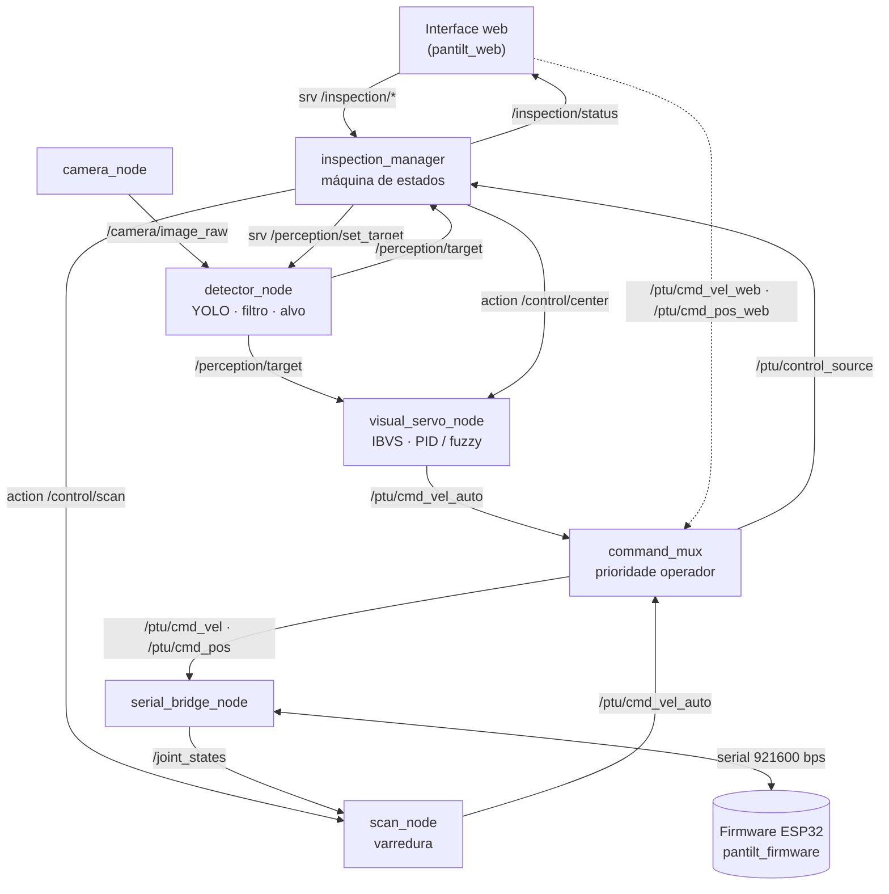
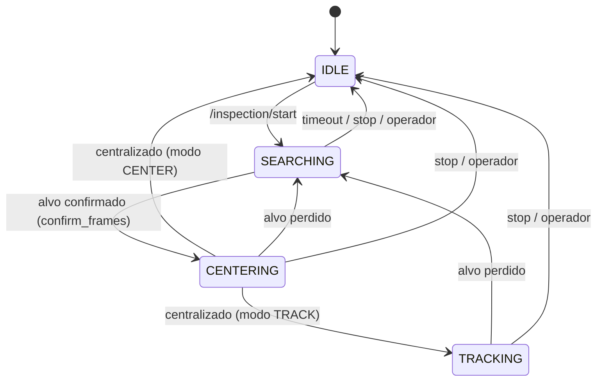

# Arquitetura do sistema pantilt_ros

Documento de referência da arquitetura de software do TCC *"Desenvolvimento de um sistema de controle servo visual baseado em mecanismo pan-tilt para orientação dinâmica de unidade de inspeção multimodal"* (UTFPR, Engenharia Mecatrônica, 2026).

Este documento é a **fonte da verdade** para nomes de nós, tópicos, services, actions e parâmetros. Qualquer mudança nesses contratos deve ser feita primeiro aqui e depois no código.

- **Autor:** Willian Luiz Giacomitti
- **Orientador:** Prof. Dr. Ronnier Frates Rohrich
- **Versão do documento:** 0.1 (22/09/2026)
- **Plataforma:** ROS 2 Humble · Python (rclpy) · Docker em Windows/WSL2

---

## 1. Objetivo e escopo

A arquitetura atende ao objetivo específico (d) do TCC: *propor uma arquitetura de sistema para a integração dos módulos de percepção, controle e acionamento dos atuadores*. Ela implementa o comportamento descrito na seção 3.5 do TCC:

1. recepção do comando de especificação do equipamento a ser localizado;
2. execução da varredura de área por comandos de velocidade ao pan-tilt;
3. seleção do alvo a partir das detecções do sistema de percepção;
4. centralização do alvo no quadro de imagem pela malha de controle IBVS.

Fluxo operacional completo:

> **IDLE** (operador controla pela interface) → operador escolhe o equipamento → **filtro** aplicado na detecção → **varredura** → **seleção** da bbox (maior confiança × área) → **centralização** IBVS → **rastreamento** (opcional) → retorno ao **IDLE**.

Fora de escopo nesta versão: rastreador multiobjeto com IDs (ByteTrack etc.). No ambiente de teste há no máximo um equipamento por classe em cena.

---

## 2. Princípios de projeto

1. **Uma responsabilidade por nó.** Cada nó faz uma coisa e pode ser testado isoladamente.
2. **Namespaces por camada.** O nome do tópico indica a camada:
   - `/camera`, `/perception`: o que existe na imagem;
   - `/inspection`: o que o sistema decidiu fazer;
   - `/control`: como executar o movimento;
   - `/ptu`: acesso ao hardware.
3. **O gerenciador decide, os demais executam.** Apenas o `inspection_manager` conhece a máquina de estados.
4. **Actions para tarefas longas.** Varredura e centralização são actions: têm feedback contínuo, podem ser canceladas e terminam com sucesso ou falha.
5. **O operador sempre tem prioridade** sobre o modo automático.
6. **Unidades SI em todos os tópicos** (rad, rad/s, conforme REP-103). Graus só aparecem em parâmetros de configuração, com o sufixo `_deg` no nome, e na interface web.
7. **Segurança em camadas.** Fail-safe no firmware (500 ms sem comunicação), watchdog de comando no `command_mux` e limites de ângulo no `serial_bridge_node`.

---

## 3. Visão geral



Camadas e pacotes:

| Camada | Pacote | Nós |
|---|---|---|
| Interfaces (contratos) | `pantilt_interfaces` | — (msg, srv, action) |
| Percepção | `pantilt_perception` | `camera_node`, `detector_node` |
| Decisão | `pantilt_manager` | `inspection_manager` |
| Controle | `pantilt_control` | `scan_node`, `visual_servo_node` |
| Acionamento | `pantilt_hardware` | `command_mux`, `serial_bridge_node` |
| Operador | `pantilt_web` | `index.html` + rosbridge + web_video_server |
| Integração | `pantilt_bringup` | launch files e configuração |

---

## 4. Nós

Os parâmetros abaixo são a proposta inicial. Os valores definitivos ficam em `pantilt_bringup/config/params.yaml`.

### 4.1 `camera_node` (pantilt_perception)

Captura quadros e publica em `/camera/image_raw`. A fonte é configurável para contornar a limitação de webcam no WSL2 (o kernel padrão normalmente não inclui o driver UVC).

| Parâmetro | Padrão | Descrição |
|---|---|---|
| `source` | `"0"` | Índice do dispositivo, URL (ex.: stream MJPEG do Windows) ou caminho de vídeo |
| `width` / `height` | 640 / 480 | Resolução solicitada |
| `fps` | 30.0 | Taxa de publicação |
| `frame_id` | `camera_optical_frame` | Frame do header |

### 4.2 `detector_node` (pantilt_perception)

Executa a YOLO (Ultralytics), aplica o filtro de classe e seleciona o alvo.

- **Sem filtro (IDLE):** publica todas as detecções em `/perception/detections`.
- **Com filtro:** publica apenas a classe escolhida. Seleciona a bbox de maior `score = confiança × área_normalizada` e publica em `/perception/target`.
- **Mapeamento por nome:** ao iniciar, lê `model.names` do modelo e cruza com o `equipment.yaml`. IDs numéricos de classe nunca aparecem no código. Uma classe do YAML ausente no modelo gera aviso no log e é removida da lista, sem travar o nó.

| Parâmetro | Padrão | Descrição |
|---|---|---|
| `model_path` | `yolo11n.pt` | Pesos (arquivo fora do git) |
| `equipment_file` | `config/equipment.yaml` | Mapeamento de equipamentos |
| `conf_threshold` | 0.5 | Confiança mínima |
| `imgsz` | 640 | Tamanho de inferência |
| `device` | `cpu` | `cpu` ou `cuda:0` |
| `publish_debug_image` | true | Publica a imagem com bboxes para a web |

### 4.3 `inspection_manager` (pantilt_manager)

Orquestra a inspeção pela máquina de estados da seção 6. Carrega o `equipment.yaml`, atende os services da interface e é cliente das actions de varredura e centralização.

| Parâmetro | Padrão | Descrição |
|---|---|---|
| `equipment_file` | `config/equipment.yaml` | Mesma configuração do detector |
| `confirm_frames` | 3 | Frames consecutivos com alvo para confirmar detecção |
| `scan_timeout_s` | 60.0 | Tempo máximo de varredura |
| `max_reacquire` | 2 | Tentativas de nova varredura após perda do alvo |
| `tolerance_px` | 20.0 | Repassado ao goal de `Center` |
| `hold_time_s` | 1.0 | Repassado ao goal de `Center` |
| `lost_timeout_s` | 1.0 | Repassado ao goal de `Center` |

### 4.4 `scan_node` (pantilt_control)

Servidor da action `/control/scan`. Executa uma varredura em zigue-zague: percorre o pan de um limite ao outro em uma faixa de tilt, troca de faixa e repete. Usa `/joint_states` para saber a posição e publica apenas velocidades em `/ptu/cmd_vel_auto`. Publica somente enquanto há um goal ativo.

| Parâmetro | Padrão | Descrição |
|---|---|---|
| `pan_min_deg` / `pan_max_deg` | -28 / 28 | Margem de 2° dos limites físicos (±30°) |
| `tilt_levels_deg` | [-20, 0, 20] | Faixas de tilt percorridas |
| `speed_deg_s` | 15.0 | Velocidade de varredura (baixa, para a YOLO acompanhar) |
| `rate_hz` | 20.0 | Taxa do laço |

### 4.5 `visual_servo_node` (pantilt_control)

Servidor da action `/control/center`. Implementa o IBVS: converte o erro em pixels de `/perception/target` em velocidades angulares de pan e tilt, publicadas em `/ptu/cmd_vel_auto`. O laço é disparado a cada nova mensagem de alvo, e o `dt` é calculado pelos timestamps.

- `controller: pid | fuzzy` escolhe o controlador. Ambos implementam a mesma interface `compute(erro, dt) -> velocidade` em `controllers/pid.py` e `controllers/fuzzy.py`.
- **Modo CENTER:** termina com sucesso quando `erro < tolerance_px` por `hold_time_s`.
- **Modo TRACK:** continua corrigindo e sinaliza `centered` no feedback até ser cancelado.
- **Alvo perdido:** sem alvo por mais de `lost_timeout_s`, publica velocidade zero e aborta.
- **Sinais:** o sentido de giro depende da montagem mecânica e é ajustado pelos parâmetros `invert_pan` e `invert_tilt` no primeiro teste.

| Parâmetro | Padrão | Descrição |
|---|---|---|
| `controller` | `pid` | `pid` ou `fuzzy` |
| `pan.kp` / `pan.ki` / `pan.kd` | a sintonizar | Ganhos do eixo pan |
| `tilt.kp` / `tilt.ki` / `tilt.kd` | a sintonizar | Ganhos do eixo tilt |
| `max_vel_deg_s` | 30.0 | Saturação da saída |
| `invert_pan` / `invert_tilt` | false / false | Convenção de sinal |

### 4.6 `command_mux` (pantilt_hardware)

Único caminho de comandos até o bridge. Aplica a prioridade e o watchdog.

- **Prioridade:** um comando da web assume o controle na hora. Enquanto a web tiver publicado nos últimos `operator_hold_s`, os comandos automáticos são descartados.
- **Watchdog:** se a fonte ativa ficar em silêncio por mais de `cmd_timeout_s`, envia uma vez velocidade zero. Isso cobre o caso em que um nó de controle trava e o firmware continuaria girando, porque recebe heartbeat do bridge.
- Publica a fonte ativa (`web`, `auto` ou `none`) em `/ptu/control_source`.

| Parâmetro | Padrão | Descrição |
|---|---|---|
| `operator_hold_s` | 1.0 | Janela de prioridade do operador |
| `cmd_timeout_s` | 0.3 | Watchdog de comando |

### 4.7 `serial_bridge_node` (pantilt_hardware)

Migrado do `pantilt_dockerfile`. É um driver puro: traduz ROS para o protocolo serial binário (seção 8) e vice-versa. Mudanças em relação à versão atual:

- a arbitração web/joystick sai deste nó e vai para o `command_mux`;
- passa a assinar `/ptu/cmd_vel` e `/ptu/cmd_pos`, em vez dos tópicos por fonte;
- o heartbeat vai de 2 Hz para 5 Hz, porque 0,5 s coincidia com o timeout de 500 ms do fail-safe;
- aplica limites de ângulo por software. Comandos de posição são recortados. Uma velocidade que empurra o eixo para fora do limite é zerada naquele eixo.

| Parâmetro | Padrão | Descrição |
|---|---|---|
| `device` | `/dev/ttyUSB0` | Resolvido pelo entrypoint via VID:PID |
| `baud` | 921600 | Deve bater com `SERIAL_BAUD` do firmware |
| `heartbeat_hz` | 5.0 | Deve ser maior que 1 / `FAILSAFE_TIMEOUT_MS` |
| `pan_limits_deg` | [-30, 30] | Limite físico |
| `tilt_limits_deg` | [-90, 90] | Limite físico |
| `limit_margin_deg` | 1.0 | Margem antes do limite |

### 4.8 Interface web (pantilt_web)

A página `index.html` é servida por HTTP e se comunica via rosbridge (roslib.js). Funções:

- vídeo com as bboxes (`/perception/debug_image` via `web_video_server`);
- seleção do equipamento (`/inspection/list_equipment`);
- iniciar e parar a inspeção;
- aviso visível de **modo automático ativo** enquanto `InspectionStatus.autonomous` for verdadeiro;
- jog manual e zero dos eixos (funções atuais mantidas).

A web usa services mais o tópico de status, e não actions diretamente, porque o suporte a actions do ROS 2 no rosbridge/roslibjs do Humble é limitado.

---

## 5. Contratos de comunicação

### 5.1 Tópicos

| Tópico | Tipo | Publica | Assina | QoS |
|---|---|---|---|---|
| `/camera/image_raw` | `sensor_msgs/Image` | camera_node | detector_node | sensor data |
| `/perception/detections` | `vision_msgs/Detection2DArray` | detector_node | web, rosbag | padrão |
| `/perception/debug_image` | `sensor_msgs/Image` | detector_node | web_video_server | sensor data |
| `/perception/target` | `pantilt_interfaces/VisualTarget` | detector_node | inspection_manager, visual_servo_node | padrão (depth 1) |
| `/inspection/status` | `pantilt_interfaces/InspectionStatus` | inspection_manager | web | transient_local |
| `/ptu/cmd_vel_auto` | `geometry_msgs/Twist` | scan_node, visual_servo_node | command_mux | padrão |
| `/ptu/cmd_vel_web` | `geometry_msgs/Twist` | web | command_mux | padrão |
| `/ptu/cmd_pos_web` | `sensor_msgs/JointState` | web | command_mux | padrão |
| `/ptu/cmd_vel` | `geometry_msgs/Twist` | command_mux | serial_bridge_node | padrão |
| `/ptu/cmd_pos` | `sensor_msgs/JointState` | command_mux | serial_bridge_node | padrão |
| `/ptu/control_source` | `std_msgs/String` | command_mux | inspection_manager, web | transient_local |
| `/joint_states` | `sensor_msgs/JointState` | serial_bridge_node | scan_node, web | padrão |
| `/ptu/errors` | `std_msgs/String` | serial_bridge_node | web | transient_local |

Convenção do `Twist` para o PTU (mantida do sistema atual): `angular.z` = pan, `angular.y` = tilt, em rad/s. Juntas em `JointState`: `pan_joint` e `tilt_joint`, em rad.

### 5.2 Services

| Nome | Tipo | Cliente → Servidor |
|---|---|---|
| `/inspection/start` | `pantilt_interfaces/StartInspection` | web → inspection_manager |
| `/inspection/stop` | `std_srvs/Trigger` | web → inspection_manager |
| `/inspection/list_equipment` | `pantilt_interfaces/ListEquipment` | web → inspection_manager |
| `/perception/set_target` | `pantilt_interfaces/SetTarget` | inspection_manager → detector_node |
| `/ptu/set_zero` | `std_srvs/Trigger` | web → serial_bridge_node |

### 5.3 Actions

| Nome | Tipo | Cliente → Servidor |
|---|---|---|
| `/control/scan` | `pantilt_interfaces/Scan` | inspection_manager → scan_node |
| `/control/center` | `pantilt_interfaces/Center` | inspection_manager → visual_servo_node |

As definições completas estão em `pantilt_interfaces/msg`, `srv` e `action`.

---

## 6. Máquina de estados do inspection_manager



| Transição | Ações executadas |
|---|---|
| IDLE → SEARCHING | chama `/perception/set_target(equip)`; publica `autonomous=true`; envia goal `Scan` |
| SEARCHING → CENTERING | cancela `Scan`; envia goal `Center` com `mode`, `tolerance_px`, `hold_time_s` e `lost_timeout_s` |
| CENTERING → TRACKING | feedback `centered=true` no modo TRACK (a action continua ativa) |
| CENTERING → IDLE | resultado `success` no modo CENTER |
| CENTERING/TRACKING → SEARCHING | `Center` abortada por perda de alvo; incrementa a contagem de tentativas; volta ao IDLE ao passar de `max_reacquire` |
| qualquer → IDLE | cancela goals ativos; chama `set_target("")`; publica `autonomous=false` e o motivo em `message` |

**Intervenção do operador:** se `/ptu/control_source` mudar para `web` fora do IDLE, o gerenciador aborta a missão e informa na interface ("Inspeção abortada pelo operador").

A seleção da bbox acontece continuamente no `detector_node`. No diagrama, ela é o evento "alvo confirmado" e não precisa de um estado próprio.

---

## 7. Configuração de equipamentos

O modelo ainda não foi treinado. Por isso, o sistema identifica classes **por nome**, nunca por ID.

`pantilt_bringup/config/equipment.yaml` (classes do TCC, seção 3.3):

```yaml
equipment:
  amortecedor:
    label: "Amortecedor de vibração"
    class_name: "amortecedor"
  esfera:
    label: "Esfera de sinalização"
    class_name: "esfera"
  isolador_bastao:
    label: "Isolador bastão"
    class_name: "isolador_bastao"
  isolador_disco:
    label: "Isolador disco"
    class_name: "isolador_disco"
```

O campo `class_name` deve ser igual ao nome da classe no dataset. Ajuste depois de rotular o dataset, se os nomes forem outros.

`pantilt_bringup/config/equipment_coco_test.yaml` serve para testar o fluxo completo antes do modelo existir, usando o `yolo11n.pt` pré-treinado no COCO:

```yaml
equipment:
  garrafa:
    label: "Garrafa (teste COCO)"
    class_name: "bottle"
  copo:
    label: "Copo (teste COCO)"
    class_name: "cup"
  celular:
    label: "Celular (teste COCO)"
    class_name: "cell phone"
```

---

## 8. Protocolo serial (firmware ↔ serial_bridge_node)

Contrato definido em `pantilt_firmware/include/Serialprotocol.h`. **Qualquer mudança exige atualizar os dois lados.**

Formato do frame: `[0xA5][0x5A][TYPE][LEN][PAYLOAD...][CRC8]`. O CRC-8 usa o polinômio 0x07 e é calculado sobre TYPE, LEN e PAYLOAD. Floats são little-endian. A taxa é de 921600 bps.

| Tipo | Código | Direção | Payload |
|---|---|---|---|
| `MSG_TELEMETRY` | 0x01 | ESP32 → host | 4 × float: pan_pos, pan_vel, tilt_pos, tilt_vel (rad, rad/s) |
| `MSG_CMD_POS` | 0x02 | host → ESP32 | 2 × float: pan, tilt (rad, absoluto) |
| `MSG_CMD_VEL` | 0x03 | host → ESP32 | 2 × float: pan, tilt (rad/s) |
| `MSG_SET_ZERO_REQ` | 0x04 | host → ESP32 | — |
| `MSG_SET_ZERO_ACK` | 0x05 | ESP32 → host | uint8 success |
| `MSG_HEARTBEAT` | 0x06 | bidirecional | — |
| `MSG_ERROR` | 0x07 | ESP32 → host | uint8 code (`ERR_*`) |
| `MSG_BOOT_INFO` | 0x08 | ESP32 → host | uint8 reset_reason, uint32 free_heap |

A telemetria é enviada a 20 Hz. O fail-safe do firmware para os motores após 500 ms sem nenhum frame recebido.

---

## 9. Segurança

| Camada | Mecanismo | Protege contra |
|---|---|---|
| Firmware | fail-safe de 500 ms | perda de comunicação com o host |
| Firmware | watchdog de tasks (3 s) | travamento do firmware |
| Firmware (futuro) | fim de curso via TMC2209 e limites por software | colisão mecânica |
| `serial_bridge_node` | limites de ângulo por software | comandos fora da faixa física |
| `command_mux` | watchdog de comando (0,3 s) | nó de controle travado com velocidade não nula |
| `command_mux` | prioridade do operador | conflito entre modo automático e manual |

---

## 10. Métricas de validação (Quadro 3 do TCC)

| Métrica | Origem na arquitetura |
|---|---|
| Tempo de convergência *t_c* | `Center.Result.convergence_time_s` (da primeira detecção válida até a estabilização) |
| Erro residual *e_r* | `Center.Result.final_error_px` |
| Erro de rastreamento *e_d* | média de `Center.Feedback.error_px` em modo TRACK durante as oscilações (gravar com `ros2 bag record`) |

---

## 11. Repositórios

| Repositório | Conteúdo |
|---|---|
| `pantilt_firmware` | Firmware da ESP32 (PlatformIO, C++/Arduino) |
| `pantilt_dockerfile` | Ambiente: Dockerfile, compose, entrypoint e scripts de Windows. Não contém nós ROS |
| `pantilt_ros` | Workspace ROS 2 (conteúdo de `/ros2_ws/src`) |

O container clona o `pantilt_ros` em um volume montado (`./ros2_ws:/ros2_ws`). Assim as alterações persistem e ficam visíveis no Windows. Os nós são lançados manualmente dentro do container.

---

## 12. Roteiro de implementação

A ordem prioriza uma fatia vertical funcionando antes dos ensaios:

1. `pantilt_dockerfile`: volume, clone, dependências e entrypoint ocioso.
2. `pantilt_interfaces` (este commit).
3. `pantilt_hardware`: migrar o bridge e criar o `command_mux`.
4. `pantilt_perception` usando o `equipment_coco_test.yaml`.
5. `visual_servo_node` com PID, testado via `ros2 action send_goal` (já permite medir *t_c* e *e_r*).
6. `scan_node` e `inspection_manager`.
7. Interface web: vídeo, seleção de equipamento e aviso de modo automático.
8. Controlador fuzzy e comparação com o PID.
9. Scripts de ensaio (rosbag e extração de métricas).

Status de cada item: ver seção "Estado atual" no `CLAUDE.md`.
