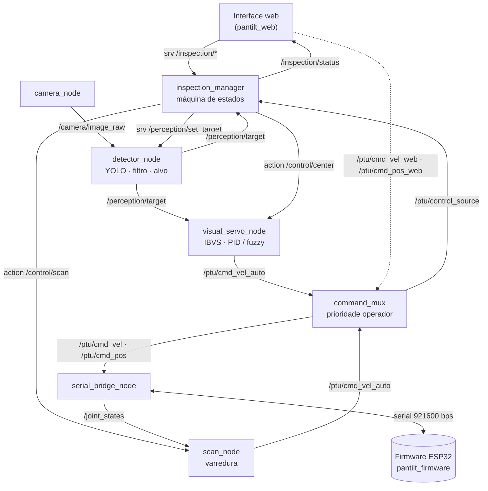
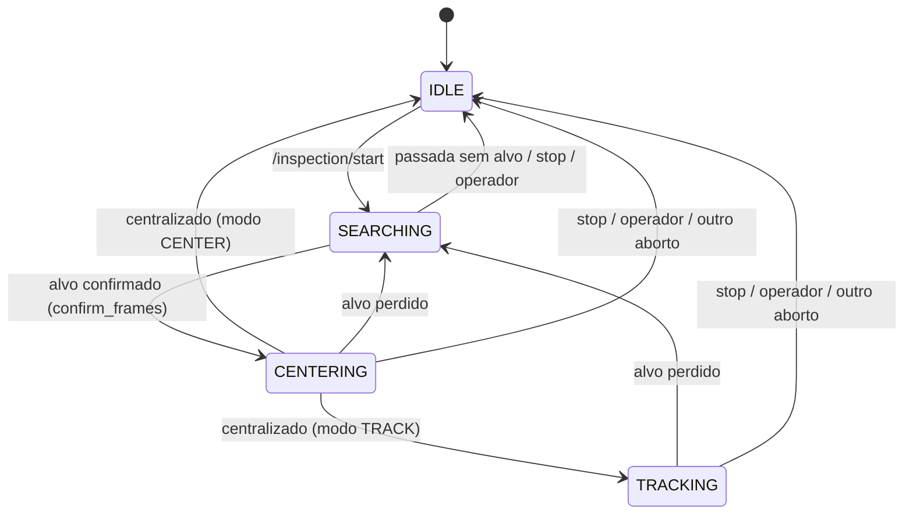

# Arquitetura do sistema pantilt_ros

Documento de referência da arquitetura de software do TCC *"Desenvolvimento de um sistema de controle servo visual baseado em mecanismo pan-tilt para orientação dinâmica de unidade de inspeção multimodal"* (UTFPR, Engenharia Mecatrônica, 2026).

Este documento é a **fonte da verdade** para nomes de nós, tópicos, services, actions e parâmetros. Qualquer mudança nesses contratos deve ser feita primeiro aqui e depois no código.

- **Autor:** Willian Luiz Giacomitti
- **Orientador:** Prof. Dr. Ronnier Frates Rohrich
- **Versão do documento:** 0.5 (08/10/2026): comportamento do `inspection_manager` detalhado (recusas do início, confirmação do alvo, uma passada de varredura, readquisição por perdas consecutivas, status)
  - 0.4 (08/10/2026): camada de controle e calibração (`CameraInfo` no `camera_node`, especificação completa do `visual_servo_node`, `/ptu/cmd_pos_auto` no `command_mux`, novo `calibration_node`, métricas precisadas)
  - 0.3 (02/10/2026): comportamento do `detector_node` detalhado (alvo só com filtro, quadros descartados, pesos locais) e `ListEquipment` lido só do yaml
- **Plataforma:** ROS 2 Humble · Python (rclpy) · Docker em Windows/WSL2

---

## 1. Objetivo e escopo

A arquitetura atende ao objetivo específico (d) do TCC: *propor uma arquitetura de sistema para a integração dos módulos de percepção, controle e acionamento dos atuadores*. Ela implementa o comportamento descrito na seção 3.5 do TCC:

1. recepção do comando de especificação do equipamento a ser localizado;
2. execução da varredura de área por comandos de velocidade ao pan-tilt;
3. seleção do alvo a partir das detecções do sistema de percepção;
4. centralização do alvo no quadro de imagem pela malha de controle IBVS.

Fluxo operacional completo:

> **IDLE** (operador controla pela interface) → operador escolhe o equipamento → **filtro** aplicado na detecção → **varredura** → **seleção** da bbox (maior confiança × área) → **centralização** IBVS → **rastreamento** (opcional) → retorno ao **IDLE**.

Fora de escopo nesta versão: rastreador multiobjeto com IDs (ByteTrack etc.). No ambiente de teste há no máximo um equipamento por classe em cena.

---

## 2. Princípios de projeto

1. **Uma responsabilidade por nó.** Cada nó faz uma coisa e pode ser testado isoladamente.
2. **Namespaces por camada.** O nome do tópico indica a camada:
   - `/camera`, `/perception`: o que existe na imagem;
   - `/inspection`: o que o sistema decidiu fazer;
   - `/control`: como executar o movimento;
   - `/ptu`: acesso ao hardware.
3. **O gerenciador decide, os demais executam.** Apenas o `inspection_manager` conhece a máquina de estados.
4. **Actions para tarefas longas.** Varredura e centralização são actions: têm feedback contínuo, podem ser canceladas e terminam com sucesso ou falha.
5. **O operador sempre tem prioridade** sobre o modo automático.
6. **Unidades SI em todos os tópicos** (rad, rad/s, conforme REP-103). Graus só aparecem em parâmetros de configuração, com o sufixo `_deg` no nome, e na interface web.
7. **Segurança em camadas.** Fail-safe no firmware (500 ms sem comunicação), watchdog de comando no `command_mux` e limites de ângulo no `serial_bridge_node`.

---

## 3. Visão geral


```mermaid
flowchart TB
  web["Interface web<br/>(pantilt_web)"]
  mgr["inspection_manager<br/>máquina de estados"]
  cam["camera_node"]
  det["detector_node<br/>YOLO · filtro · alvo"]
  scan["scan_node<br/>varredura"]
  servo["visual_servo_node<br/>IBVS · PID / fuzzy"]
  mux["command_mux<br/>prioridade operador"]
  bridge["serial_bridge_node"]
  fw[("Firmware ESP32<br/>pantilt_firmware")]

  web -- "srv /inspection/*" --> mgr
  mgr -- "/inspection/status" --> web
  cam -- "/camera/image_raw" --> det
  mgr -- "srv /perception/set_target" --> det
  det -- "/perception/target" --> mgr
  det -- "/perception/target" --> servo
  mgr -- "action /control/scan" --> scan
  mgr -- "action /control/center" --> servo
  scan -- "/ptu/cmd_vel_auto" --> mux
  servo -- "/ptu/cmd_vel_auto" --> mux
  web -. "/ptu/cmd_vel_web · /ptu/cmd_pos_web" .-> mux
  mux -- "/ptu/cmd_vel · /ptu/cmd_pos" --> bridge
  mux -- "/ptu/control_source" --> mgr
  bridge -- "/joint_states" --> scan
  bridge <-- "serial 921600 bps" --> fw
```

Camadas e pacotes:

| Camada | Pacote | Nós |
|---|---|---|
| Interfaces (contratos) | `pantilt_interfaces` | — (msg, srv, action) |
| Percepção | `pantilt_perception` | `camera_node`, `detector_node`, `calibration_node` |
| Decisão | `pantilt_manager` | `inspection_manager` |
| Controle | `pantilt_control` | `scan_node`, `visual_servo_node` |
| Acionamento | `pantilt_hardware` | `command_mux`, `serial_bridge_node` |
| Operador | `pantilt_web` | `index.html` + rosbridge + web_video_server |
| Integração | `pantilt_bringup` | launch files e configuração |
| Ferramenta auxiliar | `pantilt_dataset` | `capture_node` (coleta de vídeos para o dataset) |

O `pantilt_dataset` não faz parte do fluxo de inspeção. Ele serve para gravar os vídeos que formam o dataset de treino da YOLO, usando a câmera e a varredura do sistema (seção 4.9).

O `calibration_node` também fica fora do fluxo de inspeção: é uma rotina chamada pelo operador para estimar a distância focal em pixels, de que o `visual_servo_node` depende (seção 4.10).

---

## 4. Nós

Os parâmetros abaixo são a proposta inicial. Os valores definitivos ficam em `pantilt_bringup/config/params.yaml`.

### 4.1 `camera_node` (pantilt_perception)

Captura quadros e publica em `/camera/image_raw`. A fonte é configurável para contornar a limitação de webcam no WSL2 (o kernel padrão normalmente não inclui o driver UVC).

| Parâmetro | Padrão | Descrição |
|---|---|---|
| `source` | `"0"` | Índice do dispositivo, URL (ex.: stream MJPEG do Windows) ou caminho de vídeo |
| `width` / `height` | 640 / 480 | Resolução solicitada |
| `fps` | 30.0 | Taxa de publicação |
| `frame_id` | `camera_optical_frame` | Frame do header |
| `camera_info_file` | `config/camera_intrinsics.yaml` (caminho absoluto no `params.yaml`) | Arquivo gerado pelo `calibration_node` |
| `camera_name` | `pantilt_cam` | Nome usado no arquivo de calibração |

Além da imagem, o nó publica os parâmetros intrínsecos da câmera em `/camera/camera_info` (`sensor_msgs/CameraInfo`), lidos de um arquivo no formato padrão do ROS (o mesmo do `camera_calibration_parsers`). É assim que `f_x`, `f_y`, `c_x` e `c_y` chegam ao `visual_servo_node`: esses valores nunca são parâmetros do nó de controle nem constantes no código.

- A mensagem de `CameraInfo` usa o **mesmo `header.stamp` e `frame_id`** do quadro correspondente e vai no mesmo perfil de QoS da imagem.
- Se o arquivo não existir, o nó publica `CameraInfo` com a matriz `K` zerada e registra um aviso único no log. Quem consome trata `f_x = 0` como "sem calibração". Nesse caso `R` e `P` também vão zerados, e `D` e `distortion_model` vazios (convenção de câmera não calibrada do `sensor_msgs/CameraInfo`).
- Se o arquivo for inválido (YAML malformado, chave obrigatória ausente, `f ≤ 0`), o nó registra um **erro** e segue como sem arquivo: publica a imagem normalmente e o `CameraInfo` com `K` zerada. A imagem continua útil para a web e para a coleta de dataset, e o `visual_servo_node` recusa o goal com mensagem explícita.
- `CameraInfo.width` e `height` são sempre os do quadro publicado. Se a resolução do arquivo não bater com a do quadro entregue pela fonte, o nó avisa e **não** reescala os valores: a calibração deve ser refeita.
- Obrigatórios no arquivo: `image_width`, `image_height` e `camera_matrix`. A distorção, a `R` e a `P` são repassadas do arquivo quando existirem (o mesmo leitor serve para um arquivo da calibração por tabuleiro). Se faltarem, valem distorção nula (`plumb_bob`), `R` identidade e `P = [K | 0]`.
- Um `camera_name` do arquivo diferente do parâmetro só gera aviso.
- O arquivo é lido só no início. Depois de uma nova calibração, reinicie o `camera_node`.

### 4.2 `detector_node` (pantilt_perception)

Executa a YOLO (Ultralytics), aplica o filtro de classe e seleciona o alvo.

- **Sem filtro (IDLE):** publica em `/perception/detections` as detecções de todas as classes do modelo. Não publica em `/perception/target`.
- **Com filtro:** `/perception/detections` traz apenas a classe escolhida. A cada quadro processado, seleciona a bbox de maior `score = confiança × área_normalizada` (área da bbox dividida pela área da imagem) e publica em `/perception/target`, com `detected=false` quando não há candidato.
- **Filtro:** definido por `/perception/set_target` com a chave do `equipment.yaml`; `""` remove o filtro. Uma chave desconhecida ou ausente do modelo é recusada (`success=false`).
- **Mapeamento por nome:** ao iniciar, lê `model.names` do modelo e cruza com o `equipment.yaml`. IDs numéricos de classe nunca aparecem no código. Uma classe do YAML ausente no modelo gera aviso no log e é removida da lista, sem travar o nó.
- **Quadros:** processa sempre o quadro mais recente (assinatura com fila de 1). Os quadros que chegam durante uma inferência são descartados, para não acumular atraso na malha IBVS.
- **Header:** todas as saídas usam o header da imagem de origem (instante da captura). O `visual_servo_node` calcula o `dt` por esses timestamps.
- **Imagem de debug:** só é desenhada quando `/perception/debug_image` tem assinante (ex.: a página aberta).
- **Pesos:** o nó não baixa pesos. Se `model_path` não existir, encerra com erro e indica o comando de download. Os pesos ficam em `/ros2_ws/models/`, fora do git.

| Parâmetro | Padrão | Descrição |
|---|---|---|
| `model_path` | `/ros2_ws/models/yolo11n.pt` | Pesos (arquivo fora do git) |
| `equipment_file` | `config/equipment_coco_test.yaml` (caminho absoluto no `params.yaml`) | Mapeamento de equipamentos; `config/equipment.yaml` depois do treino |
| `conf_threshold` | 0.5 | Confiança mínima |
| `imgsz` | 640 | Tamanho de inferência |
| `device` | `cpu` | `cpu` ou `cuda:0` |
| `publish_debug_image` | true | Publica a imagem com bboxes para a web |

### 4.3 `inspection_manager` (pantilt_manager)

Orquestra a inspeção pela máquina de estados da seção 6. Carrega o `equipment.yaml`, atende os services da interface e é cliente das actions de varredura e centralização.

O `/inspection/list_equipment` lista o `equipment.yaml` sem cruzar com as classes do modelo: só o `detector_node` carrega o modelo. Um equipamento ausente do modelo é recusado pelo `/perception/set_target`, e o gerenciador repassa a recusa à interface.

- **Início (`/inspection/start`):** só a partir do IDLE. É recusado (`accepted=false`, motivo em `message`) se o estado não for IDLE, se a chave não estiver no `equipment.yaml`, se `mode` não for `MODE_CENTER` nem `MODE_TRACK`, se `/ptu/control_source` for `web` (o operador acabou de comandar) ou se `/control/scan`, `/control/center` ou `/perception/set_target` estiverem indisponíveis. Em seguida o gerenciador chama `/perception/set_target` e **espera a resposta** (até 2 s): uma recusa do detector volta à interface com a mensagem dele. Por isso o service espera numa thread do `MultiThreadedExecutor`, com o cliente do `set_target` num grupo de callbacks próprio.
- **Confirmação do alvo:** `confirm_frames` mensagens **consecutivas** de `/perception/target` com `detected=true`, `equipment` igual à chave da inspeção e `header.stamp` posterior à resposta do `set_target`. Um `detected=false` zera a contagem.
- **Varredura:** **uma passada** por entrada em SEARCHING, com o goal `Scan` (`speed_deg_s=0`, `timeout_s=scan_timeout_s`). Se a passada terminar (completa ou por tempo) sem confirmar o alvo, a inspeção volta ao IDLE com "alvo não encontrado".
- **Readquisição:** só a `Center` abortada com a mensagem `alvo perdido` (a do `visual_servo_node`, seção 4.5) leva de volta ao SEARCHING. `max_reacquire` conta perdas **consecutivas**: a contagem zera sempre que o feedback trouxer `centered=true`. Qualquer outro término sem sucesso da `Center` (preso no limite, goal recusado, servidor fora do ar) volta ao IDLE com o motivo.
- **TRACKING:** entra no primeiro feedback com `centered=true` no modo TRACK e não volta ao CENTERING se o erro sair da tolerância; o `error_px` do status segue o feedback.
- **Status:** `/inspection/status` é publicado a cada mudança e a 5 Hz. O `error_px` vem do feedback da `Center`, o mesmo erro que a malha vê.
- **Servidores fora do ar:** durante a inspeção, o gerenciador confere periodicamente se os servidores das actions continuam no ar; se um sair sem entregar o resultado, a inspeção volta ao IDLE com o motivo.
- **Encerramento (Ctrl+C):** cancela os goals ativos, remove o filtro do detector e publica o IDLE antes de sair.

| Parâmetro | Padrão | Descrição |
|---|---|---|
| `equipment_file` | `config/equipment_coco_test.yaml` (caminho absoluto no `params.yaml`) | O mesmo arquivo do `detector_node`; `config/equipment.yaml` depois do treino |
| `confirm_frames` | 3 | Frames consecutivos com alvo para confirmar detecção |
| `scan_timeout_s` | 60.0 | Tempo máximo de varredura |
| `max_reacquire` | 2 | Perdas consecutivas do alvo que ainda levam a nova varredura |
| `tolerance_px` | 20.0 | Repassado ao goal de `Center` |
| `hold_time_s` | 1.0 | Repassado ao goal de `Center` |
| `lost_timeout_s` | 1.0 | Repassado ao goal de `Center` |

### 4.4 `scan_node` (pantilt_control)

Servidor da action `/control/scan`. Executa uma varredura em zigue-zague: percorre o pan de um limite ao outro em uma faixa de tilt, troca de faixa e repete. Usa `/joint_states` para saber a posição e publica apenas velocidades em `/ptu/cmd_vel_auto`. Publica somente enquanto há um goal ativo.

- **Padrão:** move um eixo por vez, começando pela ponta do pan mais próxima da posição atual. Termina com `completed=true` depois de percorrer todas as faixas de tilt.
- **Goal:** `speed_deg_s` e `timeout_s` iguais a 0 usam os parâmetros do nó. Um goal novo substitui o anterior.
- **Parada:** publica velocidade zero uma vez ao terminar, ser cancelado ou abortar.
- **Aborto:** para e aborta com o motivo em `message` em dois casos:
  - sem `/joint_states` por mais de 0,5 s;
  - com velocidade comandada, nenhum eixo se move por mais de 3 s. É o caso de eixo travado ou de sentido de giro invertido, que leva o eixo ao limite do bridge. O jog do operador move o eixo e não dispara o aborto.
- **Término normal:** ao fim do padrão, `completed=true`. Se `timeout_s` esgotar antes, o goal termina com `completed=false`, sem ser abortado.
- **Goals recusados:** velocidade negativa ou acima de 30°/s, e timeout negativo.

| Parâmetro | Padrão | Descrição |
|---|---|---|
| `pan_min_deg` / `pan_max_deg` | -28 / 28 | Margem de 2° dos limites físicos (±30°) |
| `tilt_levels_deg` | [-20, 0, 20] | Faixas de tilt percorridas |
| `speed_deg_s` | 15.0 | Velocidade de varredura (baixa, para a YOLO acompanhar) |
| `timeout_s` | 60.0 | Tempo máximo de um goal (0 no goal usa este valor) |
| `rate_hz` | 20.0 | Taxa do laço |

### 4.5 `visual_servo_node` (pantilt_control)

Servidor da action `/control/center`. Implementa a malha IBVS: converte o erro de imagem em velocidade angular dos eixos.

#### Fundamento

A lei clássica de IBVS, `v_c = −λ·L⁺·e`, é uma ação proporcional aplicada após o mapeamento geométrico dado pela pseudo-inversa da matriz de interação (CHAUMETTE; HUTCHINSON, 2006). Como o pan-tilt executa rotação pura, as colunas da matriz de interação que dependem da profundidade `Z` desaparecem, e `L⁺` degenera na associação direta entre cada componente do erro e um eixo. Escrevendo o erro como ângulo de linha de visada, `θ = atan(e_px / f)`, o fator `(1 + x²)` da matriz de interação é cancelado de forma exata, porque ele é a derivada da tangente. O resultado é uma planta integradora de ganho unitário em cada eixo, e o controlador se reduz a dois PIDs escalares. Dedução completa na seção teórica da monografia.

#### Pipeline (cinco estágios)

1. **Conversão.** `θ_pan = atan(error_x / f_x)` e `θ_tilt = atan(error_y / f_y)`, com `f_x` e `f_y` vindos de `/camera/camera_info`. Se ainda não houve `CameraInfo` válido (`f_x > 0`), o goal é **rejeitado** com mensagem explícita.
2. **Controlador.** Duas instâncias independentes criadas pela fábrica `criar_controlador(nome, params)` de `controllers/base.py`, segundo o parâmetro `controller`. A interface é `compute(erro, dt) -> velocidade`. O `dt` é calculado pelos `header.stamp` das mensagens de alvo, não pelo relógio do laço, porque a taxa do detector varia.
3. **Saturação e anti-windup.** Saída limitada a `max_vel_deg_s`. O integrador é congelado enquanto a saída está saturada, e o termo integral tem teto próprio (`integral_limit_deg_s`).
4. **Supervisão.** Avalia três condições de término e calcula as métricas:
   - **centrado:** `error_px ≤ tolerance_px` continuamente por `hold_time_s`;
   - **perdido:** sem alvo (`detected == false` ou sem mensagem) por `lost_timeout_s`;
   - **preso no limite:** eixo parado em `/joint_states` (menos de 0,2° de deslocamento) com comando de pelo menos 1°/s no mesmo sentido por mais de `limit_timeout_s`. É o que acontece no limite de software do bridge, que zera o eixo que empurra para fora; cobre também o eixo travado. O nó não conhece os limites do bridge. Sem `/joint_states` recente, essa checagem fica desligada (o bridge, sem telemetria, só aceita parar).
5. **Publicação.** Publica em `/ptu/cmd_vel_auto` a `publish_rate_hz`, repetindo o último comando calculado por até `cmd_hold_s`. Passado esse tempo sem alvo novo, publica zero. Isso desacopla a taxa do detector (~10 Hz) do watchdog de 0,3 s do `command_mux` e evita movimento aos trancos.

#### Semântica da action

| Situação | Resultado |
|---|---|
| Modo `MODE_CENTER`, centrado | `success=true`, com `final_error_px` e `convergence_time_s` |
| Modo `MODE_TRACK`, centrado | a action **continua ativa**; o feedback passa a trazer `centered=true` |
| Alvo perdido | `success=false`, mensagem "alvo perdido"; velocidade zerada antes de abortar |
| Preso no limite | `success=false`, mensagem indicando o eixo e o limite atingido |
| Goal cancelado | velocidade zerada; resultado com `success=false` e mensagem "cancelado" |
| Novo goal | substitui o anterior (mesmo padrão do `scan_node`); os controladores são reiniciados com `reset()` |

Em qualquer término, o nó publica velocidade zero antes de responder.

#### Parâmetros

| Parâmetro | Padrão | Unidade | Descrição |
|---|---|---|---|
| `controller` | `pid` | — | `pid` ou `fuzzy` |
| `pan.kp` / `tilt.kp` | 0.8 | s⁻¹ | equivale ao ganho λ do IBVS; teto teórico ~3 |
| `pan.ki` / `tilt.ki` | 0.0 | s⁻² | ativar só no ensaio com alvo em movimento |
| `pan.kd` / `tilt.kd` | 0.0 | — | ativar só após o PI estável |
| `derivative_filter_hz` | 2.0 | Hz | filtro de 1ª ordem na derivada |
| `max_vel_deg_s` | 20.0 | °/s | saturação da saída |
| `integral_limit_deg_s` | 10.0 | °/s | teto da contribuição integral |
| `invert_pan` / `invert_tilt` | false | — | convenção de sinal, definida no teste de bancada |
| `publish_rate_hz` | 20.0 | Hz | estágio 5 |
| `cmd_hold_s` | 0.25 | s | repetição do último comando |
| `limit_timeout_s` | 2.0 | s | tempo preso no limite antes de abortar |

#### Organização do código

```
pantilt_control/
├── visual_servo_node.py          # ROS: action server, assinaturas, publicação
├── visual_servo_math.py          # puro: conversão px→ângulo, critérios, métricas
└── controllers/
    ├── base.py                   # interface + criar_controlador()
    ├── pid.py                    # PID posicional com anti-windup
    └── fuzzy.py                  # (depois) Mamdani, mesma interface
```

A lógica pura fica fora do nó, com testes em pytest, como já foi feito em `scan_pattern.py`. A troca entre PID e fuzzy deve ser apenas o parâmetro `controller`: nenhum outro arquivo muda.

#### Sinais

O sentido de giro depende da montagem mecânica. O procedimento de bancada (ganho 0,2 s⁻¹, alvo deslocado para um lado) define `invert_pan` e `invert_tilt`, registrados em `docs/testes.md`. O `calibration_node` (seção 4.10) já informa o sentido em que o alvo se desloca na imagem com cada eixo, o que serve de conferência.

### 4.6 `command_mux` (pantilt_hardware)

Único caminho de comandos até o bridge. Aplica a prioridade e o watchdog.

- **Prioridade:** um comando da web assume o controle na hora. Enquanto a web tiver publicado nos últimos `operator_hold_s`, os comandos automáticos são descartados.
- **Watchdog:** se a fonte ativa ficar em silêncio por mais de `cmd_timeout_s`, envia uma vez velocidade zero. Isso cobre o caso em que um nó de controle trava e o firmware continuaria girando, porque recebe heartbeat do bridge.
- Publica a fonte ativa (`web`, `auto` ou `none`) em `/ptu/control_source`.
- **Posição automática:** o caminho automático aceita também comandos de **posição**, em `/ptu/cmd_pos_auto`, encaminhados para `/ptu/cmd_pos`. É o que o `calibration_node` usa para levar os eixos a ângulos conhecidos. Regras:
  - a prioridade do operador vale igualmente: comandos automáticos de posição são descartados enquanto a web tiver publicado nos últimos `operator_hold_s`;
  - o watchdog de `cmd_timeout_s` **não** se aplica a comandos de posição, que são um alvo a atingir e não um fluxo contínuo. Uma posição repassada desarma o watchdog de uma velocidade anterior, porque um zero depois dela interromperia o movimento no firmware;
  - `/ptu/control_source` continua refletindo a fonte ativa: `auto` por `cmd_timeout_s` depois da posição e, em seguida, `none`.

| Parâmetro | Padrão | Descrição |
|---|---|---|
| `operator_hold_s` | 1.0 | Janela de prioridade do operador |
| `cmd_timeout_s` | 0.3 | Watchdog de comando |

### 4.7 `serial_bridge_node` (pantilt_hardware)

Migrado do `pantilt_dockerfile`. É um driver puro: traduz ROS para o protocolo serial binário (seção 8) e vice-versa. Mudanças em relação à versão atual:

- a arbitração web/joystick sai deste nó e vai para o `command_mux`;
- passa a assinar `/ptu/cmd_vel` e `/ptu/cmd_pos`, em vez dos tópicos por fonte;
- o heartbeat vai de 2 Hz para 5 Hz, porque 0,5 s coincidia com o timeout de 500 ms do fail-safe;
- aplica limites de ângulo por software. Comandos de posição são recortados. Uma velocidade que empurra o eixo para fora do limite é zerada naquele eixo.

| Parâmetro | Padrão | Descrição |
|---|---|---|
| `device` | `/dev/ttyUSB0` | Resolvido pelo entrypoint via VID:PID |
| `baud` | 921600 | Deve bater com `SERIAL_BAUD` do firmware |
| `heartbeat_hz` | 5.0 | Deve ser maior que 1 / `FAILSAFE_TIMEOUT_MS` |
| `pan_limits_deg` | [-30, 30] | Limite físico |
| `tilt_limits_deg` | [-90, 90] | Limite físico |
| `limit_margin_deg` | 1.0 | Margem antes do limite |
| `reconnect_interval_s` | 1.0 | Espera entre tentativas de abrir a serial |
| `stale_timeout_s` | 1.0 | Sem frames da ESP32 por mais que isso gera aviso em `/ptu/errors` |

### 4.8 Interface web (pantilt_web)

A página `index.html` é servida por HTTP e se comunica via rosbridge (roslib.js). Funções:

- vídeo com as bboxes (`/perception/debug_image` via `web_video_server`);
- seleção do equipamento (`/inspection/list_equipment`);
- iniciar e parar a inspeção;
- aviso visível de **modo automático ativo** enquanto `InspectionStatus.autonomous` for verdadeiro;
- jog manual e zero dos eixos (funções atuais mantidas).

A web usa services mais o tópico de status, e não actions diretamente, porque o suporte a actions do ROS 2 no rosbridge/roslibjs do Humble é limitado.

A página também tem um painel de coleta de dataset (seção 4.9), que usa os services `/capture/*` e o tópico `/capture/status`.

### 4.9 `capture_node` (pantilt_dataset)

Ferramenta auxiliar para montar o dataset de treino. Grava `/camera/image_raw` em vídeo e, opcionalmente, mantém o pan-tilt varrendo com o `scan_node`. Para a web, cumpre o papel que o `inspection_manager` cumpre na inspeção: atende os services da página e é cliente da action `/control/scan`.

- **Gravação:** um MP4 por sessão em `output_dir`, com o nome `AAAAMMDD_HHMMSS_<sessao>.mp4`, e um `.json` de metadados com sessão, horários, duração, quadros, taxa real, resolução e parâmetros da varredura. Uma gravação sem nenhum quadro não deixa arquivo.
- **Varredura:** com `scan=true` no `/capture/start`, envia goals `Scan` em sequência enquanto grava. O `/capture/stop` cancela o goal. O jog do operador continua com prioridade pelo `command_mux`, sem interromper a gravação. Se a varredura for interrompida (goal recusado, abortado ou cancelado por outro cliente), a gravação continua sem varrer. Com `scan=true` e o `scan_node` indisponível, o início é recusado.
- **Disco:** recusa o início, ou encerra a gravação com o arquivo finalizado, se o espaço livre em `output_dir` ficar abaixo de `min_free_gb`.
- A escrita do vídeo roda numa thread própria, com fila. Quadros descartados por fila cheia são contados em `CaptureStatus.dropped`.

Interfaces (em `pantilt_interfaces`):

- `srv/StartCapture`: requisição `session` (texto livre, limpo para `[a-z0-9_-]` no nome do arquivo), `scan` (bool) e `speed_deg_s` (0 = padrão do `scan_node`); resposta `accepted`, `message` e `file`.
- `msg/CaptureStatus`: `header`, `recording`, `scanning`, `session`, `file`, `elapsed_s`, `frames`, `dropped` e `message`. É publicado a 2 Hz e a cada mudança.

| Parâmetro | Padrão | Descrição |
|---|---|---|
| `output_dir` | `/ros2_ws/datasets` | Pasta dos vídeos (fora do `src/` e do git; visível no Windows) |
| `record_fps` | 15.0 | Taxa máxima gravada |
| `fourcc` | `mp4v` | Codec do OpenCV |
| `min_free_gb` | 1.0 | Espaço livre mínimo para gravar |
| `queue_size` | 30 | Tamanho da fila do escritor |

### 4.10 `calibration_node` (pantilt_perception)

Estima a distância focal em pixels usando o próprio mecanismo: gira a câmera em ângulos conhecidos e mede o deslocamento do alvo na imagem.

#### Fundamento

Pelo modelo pinhole, `u − c_x = f_x · tan(α)`, em que `α` é o ângulo entre o eixo óptico e a linha de visada ao alvo. Sob **rotação pura**, a profundidade do alvo não entra na equação, então a distância até o alvo e o tamanho dele são irrelevantes. É a mesma propriedade que dispensa a estimativa de `Z` no IBVS deste sistema.

Com o alvo fixo no mundo e o eixo no ângulo `θ_i`, o modelo ajustado por eixo é:

```
e_i = k · tan(θ_i − φ)        f = |k|
```

- `e_i` é o erro publicado pelo detector (`error_x` no pan, `error_y` no tilt), medido em relação ao centro geométrico da imagem;
- `φ` é a direção (desconhecida) do alvo em relação ao zero do encoder;
- o sinal de `k` indica para que lado o alvo se desloca na imagem quando o eixo gira no sentido positivo. O nó informa esse sentido, mas ele não entra no arquivo.

**O ponto principal fica fixo no centro geométrico** (`c_x = W/2`, `c_y = H/2`). Sob rotação pura, um deslocamento de `c` e um de `φ` produzem quase o mesmo efeito na imagem: eles só se distinguem pela curvatura da tangente, que muda ~3% numa grade de ±10°. Uma simulação com 7 pontos a ±10° e 1 px de ruído deu `c` com desvio de ±30 px quando livre, e ainda piorou `f` (±4 px contra ±3 px com `c` fixo; ±19 px contra ±6 px numa grade de ±6°). Como o detector e o `visual_servo_node` medem o erro em relação ao centro geométrico, fixar `c` é também coerente com o uso. O ponto principal só é observável pela calibração por tabuleiro.

Ajustar várias amostras por mínimos quadrados, em vez de usar a fórmula de dois pontos, dá um resíduo que denuncia encoder ruim ou distorção e dispensa centralizar o alvo com precisão.

#### Interface

| Service | Tipo | Função |
|---|---|---|
| `/calibration/run` | `std_srvs/Trigger` | Executa a rotina completa e grava o arquivo |
| `/calibration/abort` | `std_srvs/Trigger` | Interrompe a rotina e devolve os eixos à posição inicial |

A rotina leva dezenas de segundos, e o `run` só responde ao final, com os valores e o resíduo na mensagem. Por isso o service usa `ReentrantCallbackGroup` com `MultiThreadedExecutor`: sem isso, as assinaturas de `/perception/target` e `/joint_states` ficam paradas durante a execução.

O nó assina `/perception/target`, `/joint_states`, `/ptu/control_source` e `/camera/camera_info`. Este último serve só para registrar no log a calibração anterior. Ele publica apenas posições, em `/ptu/cmd_pos_auto`.

#### Pré-condições (verificadas ao receber `run`)

1. `/perception/target` recente com `detected == true` e erro dentro de 20% da meia-dimensão do quadro em cada eixo (alvo aproximadamente centralizado pelo operador);
2. eixos parados e a no máximo 1° de zero (o operador já usou `/ptu/set_zero`);
3. `/ptu/control_source` diferente de `web`;
4. nenhuma rotina em andamento.

Falhando qualquer uma, o service retorna `success=false` com a razão. O nó **não** centraliza o alvo sozinho: essa é a etapa manual do operador, feita pela página web.

#### Rotina

1. Registra a posição inicial (*home*) a partir de `/joint_states`.
2. **Sondagem:** move o pan `±probe_deg`, mede o deslocamento e estima um `f` grosseiro.
3. **Grade em cruz adaptativa:** com o `f` grosseiro, escolhe `n_points` ângulos simétricos em torno do *home*. O maior deles é aquele cujo deslocamento previsto fica em torno de 35% da meia-dimensão do quadro (largura no pan, altura no tilt), limitado a `max_angle_deg`. Varre o pan com o tilt no *home* e depois o tilt com o pan no *home*, sempre do ângulo mais negativo para o mais positivo (mesmo sentido de aproximação). A cruz evita o acoplamento entre os eixos e mantém cada ajuste unidimensional.
4. Em cada ponto: envia a posição por `/ptu/cmd_pos_auto` e espera a junta estabilizar (`|θ − θ_alvo| < settle_tol_deg` com velocidade próxima de zero). Depois espera `settle_extra_s` e coleta `samples_per_point` mensagens de alvo **cujo `header.stamp` seja posterior ao instante de parada**, por causa dos ~115 ms de atraso da imagem. Guarda a mediana do erro e a mediana do ângulo medido nessa janela.
5. Pontos sem detecção são descartados, com aviso no log. Menos de `min_points` válidos em algum eixo aborta a calibração.
6. Retorna ao *home* e espera estabilizar. O nó não publica velocidade zero: um `CMD_VEL` nulo logo depois de um `CMD_POS` interromperia o movimento no firmware.
7. Ajusta os dois modelos por mínimos quadrados não lineares (Levenberg-Marquardt implementado com numpy, sem dependência nova). O chute inicial vem da fórmula de dois pontos com `φ = 0`.
8. Grava `config/camera_intrinsics.yaml` no formato padrão do ROS (`image_width`, `image_height`, `camera_name`, `camera_matrix`, `distortion_model`, `distortion_coefficients` zerados, `rectification_matrix`, `projection_matrix`). Devolve na mensagem `f_x`, `f_y`, `c_x`, `c_y`, o resíduo RMS em px por eixo, o número de pontos usados, o FOV implícito (`2·atan(W / 2f_x)` e `2·atan(H / 2f_y)`) e o sentido de cada eixo.

**Término e retorno ao *home*:**

| Situação | Retorno ao *home* |
|---|---|
| Sucesso, `/calibration/abort`, pontos insuficientes, junta que não estabiliza, erro interno | sim |
| Operador assumiu o controle (`/ptu/control_source` = `web`) | **não**: o nó para de comandar e o operador fica com o controle |
| Nó encerrado (Ctrl+C) no meio da rotina | **não**: conta como intervenção do operador; nada se move depois que o nó sai |
| Sem `/joint_states` | não (sem posição conhecida); o nó só aborta |

#### Parâmetros

| Parâmetro | Padrão | Descrição |
|---|---|---|
| `probe_deg` | 3.0 | Amplitude da sondagem inicial |
| `max_angle_deg` | 10.0 | Ângulo máximo da grade (limita a distorção) |
| `n_points` | 7 | Pontos por eixo, simétricos em torno do *home* |
| `samples_per_point` | 5 | Mensagens de alvo por ponto (usa a mediana) |
| `settle_tol_deg` | 0.2 | Tolerância para considerar a junta parada no alvo |
| `settle_extra_s` | 0.4 | Espera extra após a parada (atraso da imagem) |
| `min_points` | 4 | Mínimo de pontos válidos por eixo |
| `output_file` | `config/camera_intrinsics.yaml` (caminho absoluto no `params.yaml`) | Arquivo gerado; o mesmo `camera_info_file` do `camera_node` |
| `camera_name` | `pantilt_cam` | Nome gravado no arquivo; o mesmo do `camera_node` |

#### Interpretação do resultado

- resíduo RMS abaixo de ~2 px: bom;
- resíduo alto, com padrão sistemático nas pontas da grade: distorção radial. Reduza `max_angle_deg` ou faça a calibração por tabuleiro;
- resíduo alto e disperso: provável erro de encoder;
- `f_x` distante de `(W/2)/tan(FOV_h/2)` em mais de ~15% (FOV do datasheet): desconfie do encoder ou do FOV declarado.

A calibração por tabuleiro de xadrez (OpenCV) continua sendo o método de referência e permanece como script offline, não como nó. Ela é obrigatória se a OAK-D entrar no projeto ou se a distorção se mostrar relevante.

---

## 5. Contratos de comunicação

### 5.1 Tópicos

| Tópico | Tipo | Publica | Assina | QoS |
|---|---|---|---|---|
| `/camera/image_raw` | `sensor_msgs/Image` | camera_node | detector_node | sensor data |
| `/camera/camera_info` | `sensor_msgs/CameraInfo` | camera_node | visual_servo_node, calibration_node | sensor data (igual ao da imagem) |
| `/perception/detections` | `vision_msgs/Detection2DArray` | detector_node | web, rosbag | padrão |
| `/perception/debug_image` | `sensor_msgs/Image` | detector_node | web_video_server | sensor data |
| `/perception/target` | `pantilt_interfaces/VisualTarget` | detector_node | inspection_manager, visual_servo_node, calibration_node | padrão (depth 1) |
| `/inspection/status` | `pantilt_interfaces/InspectionStatus` | inspection_manager | web | transient_local |
| `/ptu/cmd_vel_auto` | `geometry_msgs/Twist` | scan_node, visual_servo_node | command_mux | padrão |
| `/ptu/cmd_vel_web` | `geometry_msgs/Twist` | web | command_mux | padrão |
| `/ptu/cmd_pos_web` | `sensor_msgs/JointState` | web | command_mux | padrão |
| `/ptu/cmd_pos_auto` | `sensor_msgs/JointState` | calibration_node | command_mux | padrão |
| `/ptu/cmd_vel` | `geometry_msgs/Twist` | command_mux | serial_bridge_node | padrão |
| `/ptu/cmd_pos` | `sensor_msgs/JointState` | command_mux | serial_bridge_node | padrão |
| `/ptu/control_source` | `std_msgs/String` | command_mux | inspection_manager, calibration_node, web | transient_local |
| `/joint_states` | `sensor_msgs/JointState` | serial_bridge_node | scan_node, visual_servo_node, calibration_node, web | padrão |
| `/ptu/errors` | `std_msgs/String` | serial_bridge_node | web | transient_local |
| `/capture/status` | `pantilt_interfaces/CaptureStatus` | capture_node | web | transient_local |

Convenção do `Twist` para o PTU (mantida do sistema atual): `angular.z` = pan, `angular.y` = tilt, em rad/s. Juntas em `JointState`: `pan_joint` e `tilt_joint`, em rad.

### 5.2 Services

| Nome | Tipo | Cliente → Servidor |
|---|---|---|
| `/inspection/start` | `pantilt_interfaces/StartInspection` | web → inspection_manager |
| `/inspection/stop` | `std_srvs/Trigger` | web → inspection_manager |
| `/inspection/list_equipment` | `pantilt_interfaces/ListEquipment` | web → inspection_manager |
| `/perception/set_target` | `pantilt_interfaces/SetTarget` | inspection_manager → detector_node |
| `/ptu/set_zero` | `std_srvs/Trigger` | web → serial_bridge_node |
| `/capture/start` | `pantilt_interfaces/StartCapture` | web → capture_node |
| `/capture/stop` | `std_srvs/Trigger` | web → capture_node |
| `/calibration/run` | `std_srvs/Trigger` | operador (CLI) → calibration_node |
| `/calibration/abort` | `std_srvs/Trigger` | operador (CLI) → calibration_node |

### 5.3 Actions

| Nome | Tipo | Cliente → Servidor |
|---|---|---|
| `/control/scan` | `pantilt_interfaces/Scan` | inspection_manager, capture_node → scan_node |
| `/control/center` | `pantilt_interfaces/Center` | inspection_manager → visual_servo_node |

As definições completas estão em `pantilt_interfaces/msg`, `srv` e `action`.

---

## 6. Máquina de estados do inspection_manager


```mermaid
stateDiagram-v2
  [*] --> IDLE
  IDLE --> SEARCHING: /inspection/start
  SEARCHING --> CENTERING: alvo confirmado (confirm_frames)
  CENTERING --> TRACKING: centralizado (modo TRACK)
  CENTERING --> IDLE: centralizado (modo CENTER)
  CENTERING --> SEARCHING: alvo perdido
  TRACKING --> SEARCHING: alvo perdido
  SEARCHING --> IDLE: passada sem alvo / stop / operador
  CENTERING --> IDLE: stop / operador / outro aborto
  TRACKING --> IDLE: stop / operador / outro aborto
```

| Transição | Ações executadas |
|---|---|
| IDLE → SEARCHING | chama `/perception/set_target(equip)` e espera a resposta; publica `autonomous=true`; envia goal `Scan` |
| SEARCHING → CENTERING | alvo confirmado; cancela `Scan`; envia goal `Center` com `mode`, `tolerance_px`, `hold_time_s` e `lost_timeout_s` |
| SEARCHING → IDLE | `Scan` terminou (padrão completo ou `scan_timeout_s`) sem confirmar o alvo, ou foi recusado/abortado |
| CENTERING → TRACKING | feedback `centered=true` no modo TRACK (a action continua ativa) |
| CENTERING → IDLE | resultado `success` no modo CENTER, com `t_c` e `e_r` na mensagem |
| CENTERING/TRACKING → SEARCHING | `Center` abortada com `alvo perdido`; incrementa a contagem de perdas consecutivas (zerada a cada `centered=true`); volta ao IDLE ao passar de `max_reacquire` |
| CENTERING/TRACKING → IDLE | `Center` recusada ou terminada sem sucesso por outro motivo (ex.: preso no limite) |
| qualquer → IDLE | cancela goals ativos; chama `set_target("")` sem esperar a resposta; publica `autonomous=false` e o motivo em `message` |

**Intervenção do operador:** se `/ptu/control_source` mudar para `web` fora do IDLE, o gerenciador aborta a missão e informa na interface ("Inspeção abortada pelo operador").

A seleção da bbox acontece continuamente no `detector_node`. No diagrama, ela é o evento "alvo confirmado" e não precisa de um estado próprio.

---

## 7. Configuração de equipamentos

O modelo ainda não foi treinado. Por isso, o sistema identifica classes **por nome**, nunca por ID.

`pantilt_bringup/config/equipment.yaml` (classes do TCC, seção 3.3):

```yaml
equipment:
  amortecedor:
    label: "Amortecedor de vibração"
    class_name: "amortecedor"
  esfera:
    label: "Esfera de sinalização"
    class_name: "esfera"
  isolador_bastao:
    label: "Isolador bastão"
    class_name: "isolador_bastao"
  isolador_disco:
    label: "Isolador disco"
    class_name: "isolador_disco"
```

O campo `class_name` deve ser igual ao nome da classe no dataset. Ajuste depois de rotular o dataset, se os nomes forem outros.

`pantilt_bringup/config/equipment_coco_test.yaml` serve para testar o fluxo completo antes do modelo existir, usando o `yolo11n.pt` pré-treinado no COCO:

```yaml
equipment:
  garrafa:
    label: "Garrafa (teste COCO)"
    class_name: "bottle"
  copo:
    label: "Copo (teste COCO)"
    class_name: "cup"
  celular:
    label: "Celular (teste COCO)"
    class_name: "cell phone"
```

---

## 8. Protocolo serial (firmware ↔ serial_bridge_node)

Contrato definido em `pantilt_firmware/include/Serialprotocol.h`. **Qualquer mudança exige atualizar os dois lados.**

Formato do frame: `[0xA5][0x5A][TYPE][LEN][PAYLOAD...][CRC8]`. O CRC-8 usa o polinômio 0x07 e é calculado sobre TYPE, LEN e PAYLOAD. Floats são little-endian. A taxa é de 921600 bps.

| Tipo | Código | Direção | Payload |
|---|---|---|---|
| `MSG_TELEMETRY` | 0x01 | ESP32 → host | 4 × float: pan_pos, pan_vel, tilt_pos, tilt_vel (rad, rad/s) |
| `MSG_CMD_POS` | 0x02 | host → ESP32 | 2 × float: pan, tilt (rad, absoluto) |
| `MSG_CMD_VEL` | 0x03 | host → ESP32 | 2 × float: pan, tilt (rad/s) |
| `MSG_SET_ZERO_REQ` | 0x04 | host → ESP32 | — |
| `MSG_SET_ZERO_ACK` | 0x05 | ESP32 → host | uint8 success |
| `MSG_HEARTBEAT` | 0x06 | bidirecional | — |
| `MSG_ERROR` | 0x07 | ESP32 → host | uint8 code (`ERR_*`) |
| `MSG_BOOT_INFO` | 0x08 | ESP32 → host | uint8 reset_reason, uint32 free_heap |
| `MSG_HOME_REQ` | 0x09 | host → ESP32 | uint8 eixo (0 pan, 1 tilt, 2 ambos); definido no firmware, ainda não usado pelo host |
| `MSG_HOME_ACK` | 0x0A | ESP32 → host | uint8 eixo, uint8 sucesso; definido no firmware, ainda não usado pelo host |

Os códigos `ERR_*` do `MSG_ERROR` estão em `SerialProtocol.h` e espelhados em `serial_protocol.py` (`ERROR_CODES`).

A telemetria é enviada a 20 Hz. O fail-safe do firmware para os motores após 500 ms sem nenhum frame recebido.

---

## 9. Segurança

| Camada | Mecanismo | Protege contra |
|---|---|---|
| Firmware | fail-safe de 500 ms | perda de comunicação com o host |
| Firmware | watchdog de tasks (3 s) | travamento do firmware |
| Firmware | limites por software | colisão mecânica |
| Firmware (futuro) | home por fim de curso |
| `serial_bridge_node` | limites de ângulo por software | comandos fora da faixa física |
| `command_mux` | watchdog de comando (0,3 s) | nó de controle travado com velocidade não nula |
| `command_mux` | prioridade do operador | conflito entre modo automático e manual |
| `visual_servo_node` | aborto por permanência no limite de ângulo | malha empurrando contra o batente indefinidamente |
| `calibration_node` | aborto se o operador assumir o controle ou se o nó for encerrado (sem novo movimento); retorno ao *home* nas demais saídas; só comandos de posição, nunca velocidade | movimento autônomo inesperado durante a calibração |

---

## 10. Métricas de validação (Quadro 3 do TCC)

| Métrica | Origem na arquitetura | Definição operacional |
|---|---|---|
| Tempo de convergência *t_c* | `Center.Result.convergence_time_s` | intervalo entre a **primeira detecção válida** após o início do goal e o instante em que o erro entra na tolerância e nela permanece por `hold_time_s` |
| Erro residual *e_r* | `Center.Result.final_error_px` | **média** de `error_px` durante esse intervalo de permanência (menos sensível ao tremor da bbox que o último valor) |
| Erro de rastreamento *e_d* | `Center.Feedback.error_px` (gravar com `ros2 bag record`) | média de `error_px` no feedback, em modo TRACK, durante as oscilações da base |

---

## 11. Repositórios

| Repositório | Conteúdo |
|---|---|
| `pantilt_firmware` | Firmware da ESP32 (PlatformIO, C++/Arduino) |
| `pantilt_dockerfile` | Ambiente: Dockerfile, compose, entrypoint e scripts de Windows. Não contém nós ROS |
| `pantilt_ros` | Workspace ROS 2 (conteúdo de `/ros2_ws/src`) |

O container clona o `pantilt_ros` em um volume montado (`./ros2_ws:/ros2_ws`). Assim as alterações persistem e ficam visíveis no Windows. Os nós são lançados manualmente dentro do container.

---

## 12. Roteiro de implementação

A ordem prioriza uma fatia vertical funcionando antes dos ensaios:

1. `pantilt_dockerfile`: volume, clone, dependências e entrypoint ocioso.
2. `pantilt_interfaces` (este commit).
3. `pantilt_hardware`: migrar o bridge e criar o `command_mux`.
4. `pantilt_perception` usando o `equipment_coco_test.yaml`.
5. `visual_servo_node` com PID, testado via `ros2 action send_goal` (já permite medir *t_c* e *e_r*). Antes dele: `/ptu/cmd_pos_auto` no `command_mux`, `CameraInfo` no `camera_node` e `calibration_node` (seção 4.10), porque a malha depende da distância focal em pixels.
6. `scan_node` e `inspection_manager`.
7. Interface web: vídeo, seleção de equipamento e aviso de modo automático.
8. Controlador fuzzy e comparação com o PID.
9. Scripts de ensaio (rosbag e extração de métricas).

Fora da ordem acima, o `scan_node` foi antecipado junto com o `pantilt_dataset` (seção 4.9), porque a coleta de vídeos para o treino da YOLO depende dele.

Status de cada item: ver seção "Estado atual" no `CLAUDE.md`.
